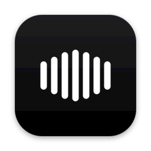
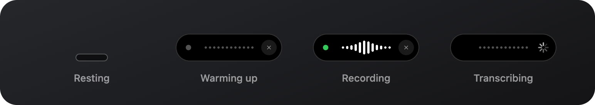
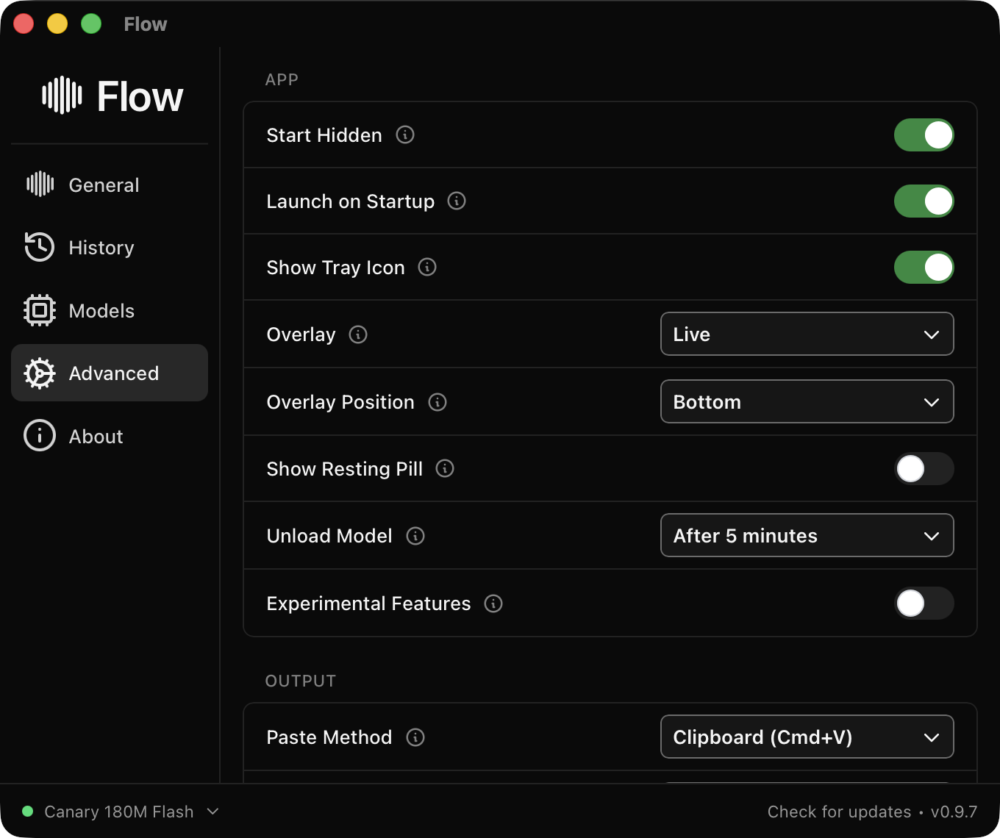

<p align="center">
  
</p>

<h1 align="center">Flow</h1>

<p align="center">
  Local, private speech-to-text for your Mac — with a Wispr Flow–style black pill.<br>
  A personal fork of <a href="https://github.com/cjpais/Handy">Handy</a>.
</p>

<p align="center">
  
</p>

<p align="center">
  
</p>

## What's different from Handy

Flow is Handy underneath: same local models (Whisper, Parakeet, Moonshine, …), same shortcuts, same paste pipeline. Only the look and feel changed.

- **Wispr Flow–style overlay.** A black capsule with white voice bars that rest as dots and rise when you speak, a green recording dot, and a dotted line with a tick spinner while transcribing.
- **Resting pill.** A small capsule sits at the bottom of the screen between dictations, springs open when you start, and settles back when the text is pasted. Clicks pass straight through it. Turn it off in **Settings → Advanced → Show Resting Pill**.
- **Black theme everywhere.** The settings window, onboarding and native title bar are always black, with green as the only accent.
- **New name and icons.** App icon, menu bar icon (a waveform, with a green dot while recording) and the in-app wordmark.
- **No auto-updates from upstream.** The updater points at this fork, so Handy releases can never overwrite Flow.

## Install (build from source)

Flow isn't published as a download — build it on your Mac (Apple Silicon):

```bash
# 1. Tools (one time)
xcode-select --install                    # if not already installed
curl --proto '=https' --tlsv1.2 -sSf https://sh.rustup.rs | sh -s -- -y
brew install cmake
curl -fsSL https://bun.sh/install | bash  # if bun is missing

# 2. Build
git clone https://github.com/Sanjeev2007/Handy-black.git flow && cd flow
bun install
bun run tauri build --bundles app --config '{"bundle":{"createUpdaterArtifacts":false}}'

# 3. Install
ditto src-tauri/target/release/bundle/macos/Flow.app /Applications/Flow.app
open /Applications/Flow.app
```

The first build takes a while (it compiles the speech engine); later builds are incremental.

### Permissions

Flow needs **Microphone** and **Accessibility** access. Every local build is ad-hoc signed, so macOS treats each rebuild as a new app: after reinstalling, open **System Settings → Privacy & Security → Accessibility**, remove the old Flow (or Handy) entry with **−**, and add `/Applications/Flow.app` again.

### Coming from Handy

Flow keeps Handy's bundle identifier (`com.pais.handy`), so your settings, history and downloaded models carry over. Don't run both apps at once — they share the same data and shortcuts.

## Development

```bash
bun install
bun run tauri dev
```

The overlay lives in `src/overlay/` (UI) and `src-tauri/src/overlay.rs` (window). See [BUILD.md](BUILD.md) and [AGENTS.md](AGENTS.md) for the full setup and architecture.

## Everything else

Usage, CLI flags, troubleshooting, manual model installation and platform notes are unchanged from Handy — see the original [Handy README](README.handy.md).

## Credits & license

Flow is built on [Handy](https://github.com/cjpais/Handy) by CJ Pais and contributors, which is powered by [transcribe.cpp](https://github.com/cjpais/transcribe.cpp) and [ggml](https://github.com/ggml-org/ggml). The overlay design is inspired by [Wispr Flow](https://wisprflow.ai); Flow is not affiliated with Wispr.

MIT licensed — see [LICENSE](LICENSE).
